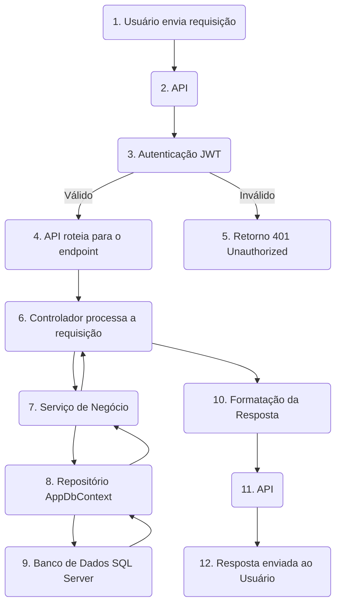

## Teste

```mermaid
graph TD
    A(1. Usuário envia requisição) --> B(2. API)
    B --> C(3. Autenticação JWT)
    C -- Válido --> D(4. API roteia para o endpoint)
    C -- Inválido --> E(5. Retorno 401 Unauthorized)
    D --> F(6. Controlador processa a requisição)
    F --> G(7. Serviço de Negócio)
    G --> H(8. Repositório AppDbContext)
    H --> I(9. Banco de Dados SQL Server)
    I --> H
    H --> G
    G --> F
    F --> J(10. Formatação da Resposta)
    J --> K(11. API)
    K --> L(12. Resposta enviada ao Usuário)
```