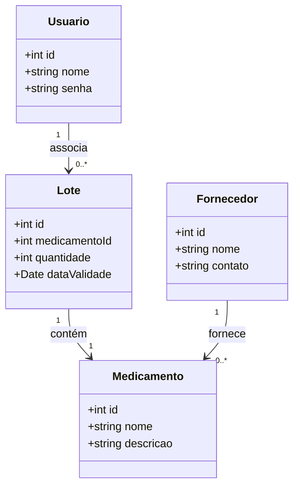
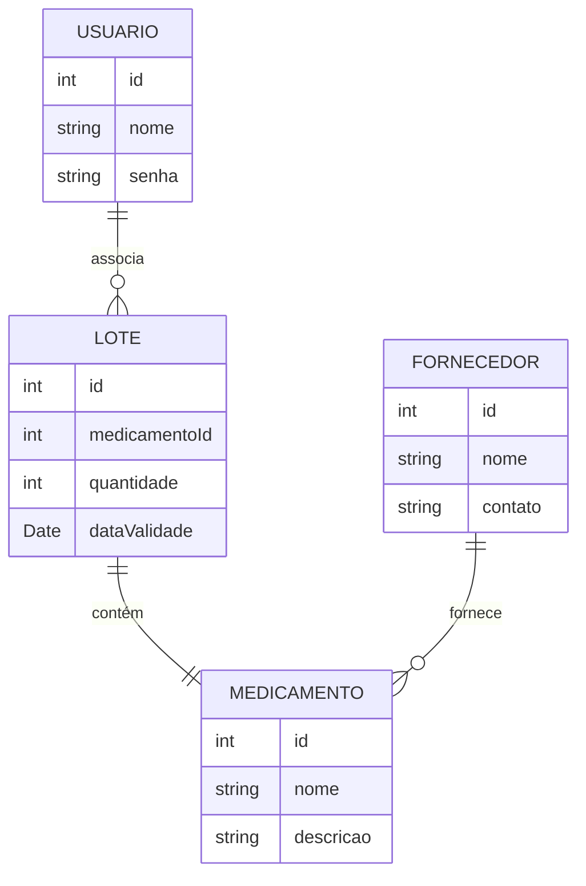

#### Diagramas de Classes

```mermaid
classDiagram
    class Usuario {
        +int id
        +string nome
        +string senha
    }

    class Lote {
        +int id
        +int medicamentoId
        +int quantidade
        +Date dataValidade
    }

    class Fornecedor {
        +int id
        +string nome
        +string contato
    }

    class Medicamento {
        +int id
        +string nome
        +string descricao
    }

    Usuario "1" --> "0..*" Lote : associa
    Lote "1" --> "1" Medicamento : contém
    Fornecedor "1" --> "0..*" Medicamento : fornece
```

#### Diagramas de Entidade-Relacionamento (ER)

```mermaid
erDiagram
    USUARIO {
        int id
        string nome
        string senha
    }

    LOTE {
        int id
        int medicamentoId
        int quantidade
        Date dataValidade
    }

    FORNECEDOR {
        int id
        string nome
        string contato
    }

    MEDICAMENTO {
        int id
        string nome
        string descricao
    }

    USUARIO ||--o{ LOTE : "associa"
    LOTE ||--|| MEDICAMENTO : "contém"
    FORNECEDOR ||--o{ MEDICAMENTO : "fornece"
```