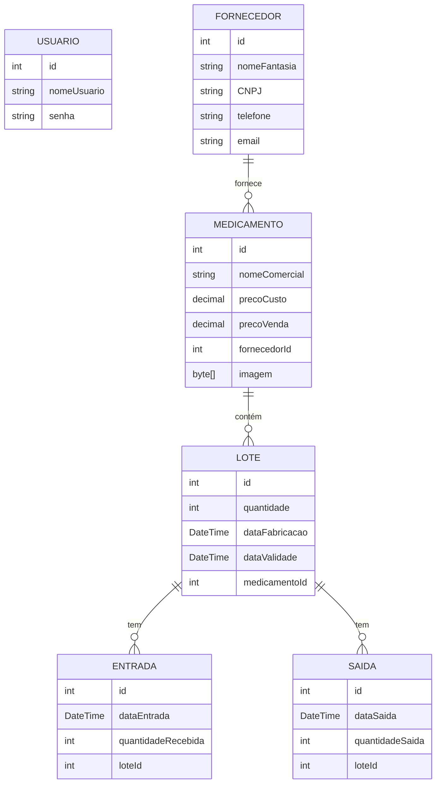

A aplicação possui as seguintes entidades:

`Usuário`: Cada usuário possui um identificador único (id), um nome de usuário (nomeUsuario) e uma senha (senha).

`Fornecedor`: Cada fornecedor possui um identificador único (id), um nome fantasia (nomeFantasia), um CNPJ (CNPJ), um telefone (telefone) e um email (email).

`Medicamento`: Cada medicamento possui um identificador único (id), um nome comercial (nomeComercial), um preço de custo (precoCusto), um preço de venda (precoVenda), um identificador de fornecedor (fornecedorId) e uma imagem (imagem).

`Lote`: Cada lote possui um identificador único (id), uma quantidade (quantidade), uma data de fabricação (dataFabricacao), uma data de validade (dataValidade) e um identificador de medicamento (medicamentoId).

`Entrada`: Cada entrada possui um identificador único (id), uma data de entrada (dataEntrada), uma quantidade recebida (quantidadeRecebida) e um identificador de lote (loteId).

`Saída`: Cada saída possui um identificador único (id), uma data de saída (dataSaida), uma quantidade saída (quantidadeSaida) e um identificador de lote (loteId).

#### Diagrama de Entidade-Relacionamento (ER)

