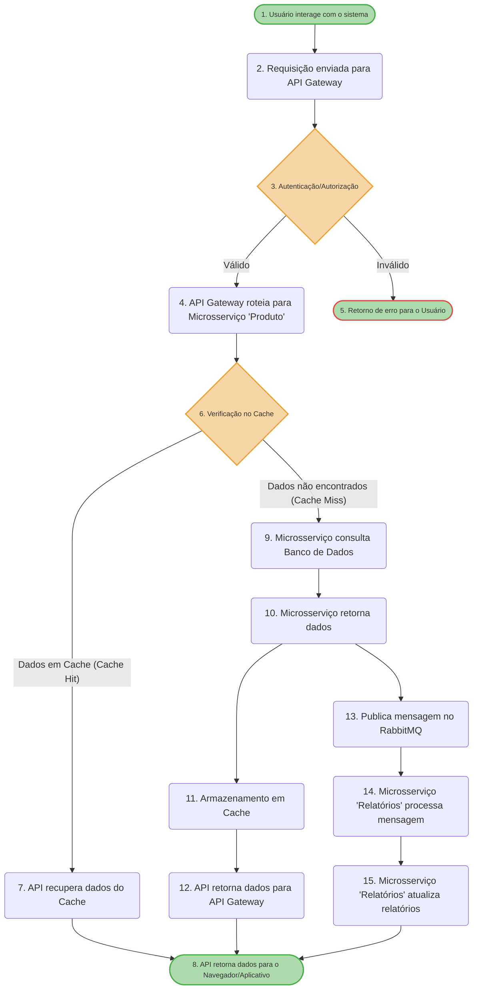

# Arquitetura da Solução

Interface Web: Onde o usuário interage com o sistema.
API Gateway: Ponto de entrada para todas as requisições, responsável por autenticação, autorização e roteamento.
Microsserviço “Produto”: Gerencia as operações relacionadas aos medicamentos.
Banco de Dados (SQL Server): Armazena os dados dos medicamentos.
RabbitMQ: Sistema para comunicação assíncrona entre microsserviços.
Microsserviço “Relatórios”: Atualiza e gera relatórios de estoque.

# Fluxo de Interação

Usuário interage com o sistema: Acessa o sistema via Navegador/Aplicativo.
Requisição enviada para a API: O Navegador/Aplicativo envia a requisição para a API (API Gateway).
Autenticação/Autorização: A API Gateway valida a autenticação do usuário e verifica as permissões.
Roteamento para Microsserviço ‘Produto’: A API Gateway roteia a requisição para o microsserviço “Produto”.
Verificação no Cache: A API verifica se os dados solicitados estão presentes no Cache (Redis).
Dados em Cache (Cache Hit): Se os dados estiverem no cache, a API recupera os dados do Cache e retorna para o Navegador/Aplicativo.
Dados não encontrados no Cache (Cache Miss): Se os dados não estiverem no cache, a API publica uma mensagem na fila (RabbitMQ).
Consulta ao Banco de Dados: O Microsserviço consulta o Banco de Dados (SQL Server) pelos dados.
Retorno dos dados: O Microsserviço retorna os dados para a fila (RabbitMQ).
Armazenamento em Cache: A API armazena os dados no Cache (Redis) para futuras requisições.
Retorno para o Usuário: A API retorna os dados para o Navegador/Aplicativo.
Publicação de mensagem no RabbitMQ: O Microsserviço “Produto” envia uma mensagem para o RabbitMQ informando a criação/atualização do medicamento.
Processamento de mensagem pelo Microsserviço ‘Relatórios’: O Microsserviço “Relatórios” recebe a mensagem e atualiza os relatórios de estoque.

# Verificação do Fluxograma

Interação do Usuário: Representado pelo item A.
Requisição para API Gateway: Representado pelo item B.
Autenticação/Autorização: Representado pelo item C.
Roteamento para Microsserviço ‘Produto’: Representado pelo item D.
Verificação no Cache: Representado pelo item F.
Cache Hit e Miss: Representado pelos itens G e I.
Consulta ao Banco de Dados: Representado pelo item I.
Retorno dos dados e Armazenamento em Cache: Representado pelos itens J e K.
Publicação de mensagem no RabbitMQ: Representado pelo item N.
Processamento de mensagem pelo Microsserviço ‘Relatórios’: Representado pelos itens O e P.