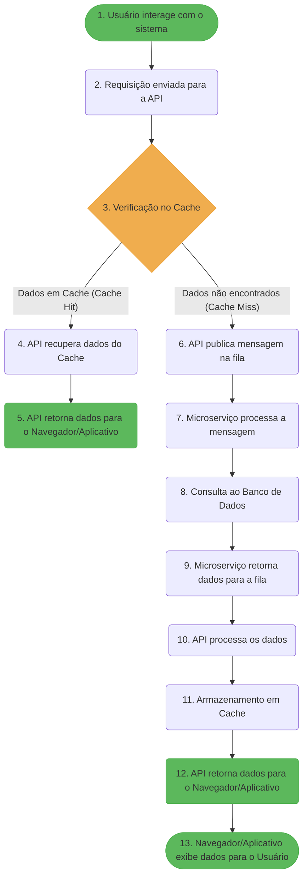

```mermaid
graph TD
    A([1. Usuário interage com o sistema]) --> B(2. Requisição enviada para a API)
    B --> C{3. Verificação no Cache}
    C -- Dados em Cache (Cache Hit) --> D(4. API recupera dados do Cache)
    D --> E(5. API retorna dados para o Navegador/Aplicativo)
    C -- Dados não encontrados (Cache Miss) --> F(6. API publica mensagem na fila)
    F --> G(7. Microserviço processa a mensagem)
    G --> H(8. Consulta ao Banco de Dados)
    H --> I(9. Microserviço retorna dados para a fila)
    I --> J(10. API processa os dados)
    J --> K(11. Armazenamento em Cache)
    K --> L(12. API retorna dados para o Navegador/Aplicativo)
    L --> M([13. Navegador/Aplicativo exibe dados para o Usuário])

    style A fill:#5cb85c,stroke:#4cae4c
    style M fill:#5cb85c,stroke:#4cae4c
    style C fill:#f0ad4e,stroke:#eea236
    style E fill:#5cb85c,stroke:#4cae4c
    style L fill:#5cb85c,stroke:#4cae4c
```

VERDE:		INICIO / FIM
AMARELO:	DECISAO
